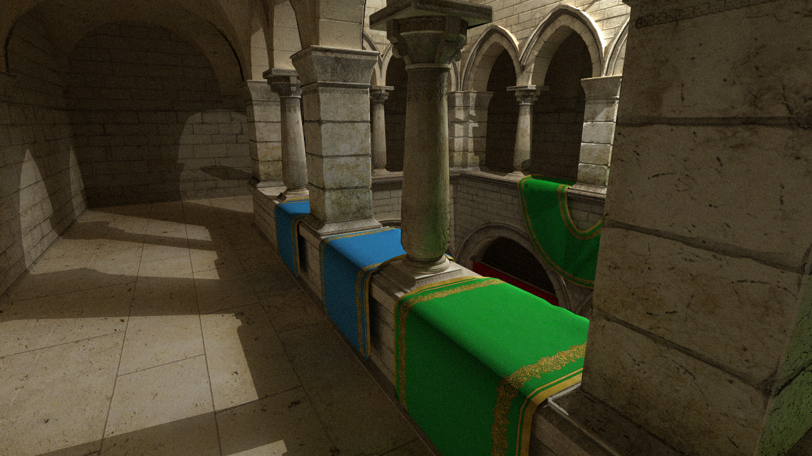
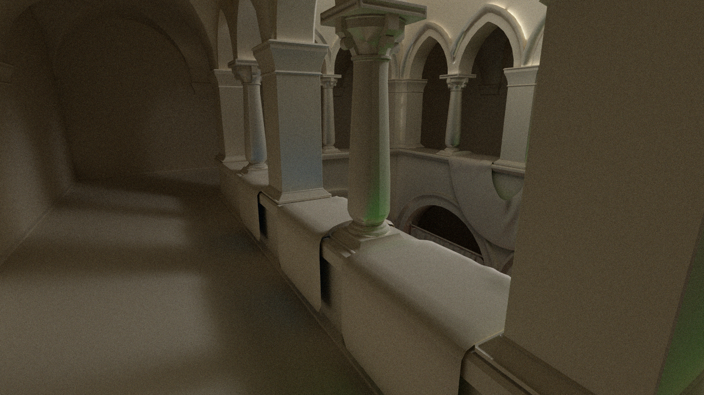

# Vulkan--Screen probe precompute

## Description

This is a substitute for computing screen probes in [Lumen](https://advances.realtimerendering.com/s2022/SIGGRAPH2022-Advances-Lumen-Wright%20et%20al.pdf) from UE5. For every 16 pixels, it places a probe and sampling the world, recording the samples in spherical harmonic functions.

This project is a part of work testing collaborative rendering based on UE5 backend(using screen probes to transfer indirect lighting). It aims to provide a way to precompute screen probes and store them into Json files, which can be used in the renderer later.

## Prerequisites

- [Vulkan SDK](https://vulkan.lunarg.com/sdk/home)
- Cmake
- Windows system and graphic card supports hardware Ray Tracing(e.g. Nvidia RTX series)
- Optinal(easy to compile): Vscode(recommended)/Visual Studio

## Implementation

It is based on [SaschaWillems's Vulkan code](https://github.com/SaschaWillems/Vulkan/), using Vulkan Ray Tracing Pipeline to fully utilize GPU power. It supports point lights and GLTF models with normal map.

Path tracing result


Indirect irradiance result



It includes 2 target: a GPU path tracing and screen probes precompute.

You can modify the parameters in cpp and shader files to change the output. 

## Visualization probe

Modify the code in file [shaders/glsl/ssprobe/raygen.rgen](./shaders/glsl/ssprobe/raygen.rgen)

```glsl
imageStore(image,ivec2(gl_LaunchIDEXT.xy),vec4(loadSH(bias+i)*k,1.));
// i : the index of the parameter of SH
// k : emplify the result because the SH coefficients are prone to be small.
```

the SH layout is in [shaders/glsl/ssprobe/SH.glsl](./shaders/glsl/ssprobe/SH.glsl)

### Tricky for denoising
- Less recursive depth/light bounces(faster, but the indirect lighting is weaker than expect)
- more samples(slower and does not make much sense if it is greater than 10k)
- more lights(recommended)
- clamp the radiance samples(need to be modified in shaders and will make the result a **little** darker)
```glsl
// e.g. in shaders/glsl/ssprobe/raygen.rgen
radiance=clamp(radiance,0.,80.);
```

